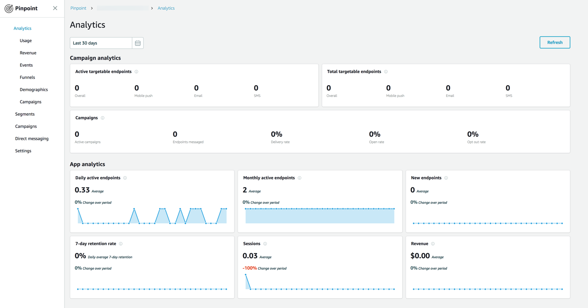
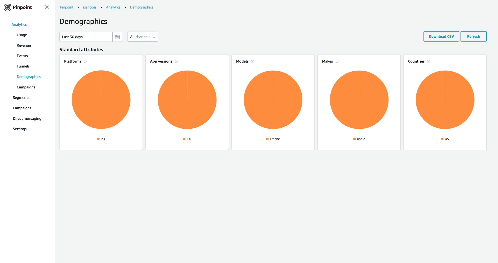

# Add Analytics to the Notes App

In the [previous section](./index.md) of this tutorial, you installed Android Studio, downloaded a sample note-taking app from GitHub, and then compiled and ran it in the Android Emulator. This tutorial assumes you have completed these steps. In this section, you extend the notes app to include application analytics. Application analytics enable you to gather demographic information about the application usage.

You should be able to complete this section in 10-15 minutes.

## Create an AWS Backend

1. Open the project in Android Studio.
2. Choose **View**, choose **Tool Windows**, and then choose **Terminal**.  This opens a terminal prompt within Android Studio at the bottom of the window.
3. In the terminal window, enter the following commands:

    ```
    $ amplify init
    ```

   The CLI prompts you through the process of initializing your backend project.  When prompted for the `Res` directory:

    ```
    ? Where is your Res directory: app/src/main/res
    ```

4. Next, add the analytics service to your backend:

   ```
   $ amplify add analytics
   ```

   Again, the CLI prompts you through the process of initializing your backend project.
5. Finally, deploy the resources you have provisioned:

   ```
   $ amplify push
   ```

The `amplify init` command does the following within your project:

*  Creates a basic backend definition in the `amplify` directory.
*  Creates an `awsconfiguration.json` file describing the backend in the `app/src/main/res/raw` resource directory.

The `amplify analytics add` command adds the appropriate entries into the backend definition file for deploying Amazon Pinpoint as a service for this project.  The `amplify push` command deploys any new services that are defined and updates the `awsconfiguration.json` file so that the new services can be used within your app.

## Add Permissions to the AndroidManifest.xml

1. Open the project in Android Studio.
2. On the left side of the project, choose **Project** to open the project browser.
3. To find the app manifest, change the project browser view menu at the top to **Android**, and open the `app/manifests` folder.
4. Add the `INTERNET`, `ACCESS_NETWORK_STATE`, and `ACCESS_WIFI_STATE` permissions to your project's `AndroidManifest.xml` file.

    ```xml
    <?xml version="1.0" encoding="utf-8"?>
    <manifest xmlns:android="http://schemas.android.com/apk/res/android"
        package="com.amazonaws.mobile.samples.mynotes">

        <uses-permission android:name="android.permission.INTERNET"/>
        <uses-permission android:name="android.permission.ACCESS_NETWORK_STATE"/>
        <uses-permission android:name="android.permission.ACCESS_WIFI_STATE"/>

        <application
            android:name=".NotesApp"
            android:allowBackup="true"
            android:icon="@mipmap/ic_launcher"
            android:label="@string/app_name"
            android:roundIcon="@mipmap/ic_launcher_round"
            android:supportsRtl="true"
            android:theme="@style/AppTheme">
        </application>
    </manifest>
    ```

## Add AWS SDK for Android Library

1. Edit the `app/build.gradle` file. Add the following lines to the `dependencies` section:

    ```gradle
    dependencies {
        // Other dependencies will be here already

        // AWS Mobile SDK for Android
        def aws_version = '2.6.27'
        implementation "com.amazonaws:aws-android-sdk-core:$aws_version"
        implementation "com.amazonaws:aws-android-sdk-auth-core:$aws_version@aar"
        implementation "com.amazonaws:aws-android-sdk-pinpoint:$aws_version"
    }
    ```

2. Choose **Sync Now** on the upper-right corner to incorporate the dependencies you just declared.

## Create an AWSService.java Class

In the sample, you need to provide a class to provide access to the configuration and identity provider objects.  These objects are central to how Android applications locate and communicate with AWS resources.  This object should be a singleton.  In the sample, you use a central dependency class to ensure that the `AWSService` object is created one time only.

1. Expand `app/java` in the Android Studio project explorer.
2. Right-click the `services` directory.
3. Choose **New** > **Package**.
4. For **Name**, enter `aws` and then choose **OK**.
5. Right-click the `aws` directory.
6. Choose **New** > **Java Class**.
7. For **Name**, enter `AWSService` and then choose **OK**.

The following is the initial code in this class:

```java
package com.amazonaws.mobile.samples.mynotes.services.aws;

import android.content.Context;

import com.amazonaws.mobile.auth.core.IdentityManager;
import com.amazonaws.mobile.config.AWSConfiguration;

public class AWSService {
    private AWSConfiguration awsConfiguration;
    private IdentityManager identityManager;

    public AWSService(Context context) {
        awsConfiguration = new AWSConfiguration(context);
        identityManager = new IdentityManager(context, awsConfiguration);
        IdentityManager.setDefaultIdentityManager(identityManager);
    }

    public IdentityManager getIdentityManager() {
        return identityManager;
    }

    public AWSConfiguration getConfiguration() {
        return awsConfiguration;
    }
}
```

## Create an AWSAnalyticsService.java Class

In our sample, the analytics service is provided through a mock dependency injection service.  The analytics service must be an object that implements the `AnalyticsService` interface.  All other parts of the application will use the `AnalyticsService` that is defined in the  `Injection` class.

1. Right-click the `aws` directory.
2. Choose **New** > **Java Class**.
3. For **Name**, enter `AWSAnalyticsService` and then choose **OK**.

The following is the initial code in this class:

```java
package com.amazonaws.mobile.samples.mynotes.services.aws;

import android.content.Context;

import com.amazonaws.auth.AWSCredentialsProvider;
import com.amazonaws.mobile.samples.mynotes.services.AnalyticsService;
import com.amazonaws.mobileconnectors.pinpoint.PinpointConfiguration;
import com.amazonaws.mobileconnectors.pinpoint.PinpointManager;
import com.amazonaws.mobileconnectors.pinpoint.analytics.AnalyticsEvent;
import java.util.Map;

public class AWSAnalyticsService implements AnalyticsService {
    private PinpointManager pinpointManager;

    public AWSAnalyticsService(Context context, AWSService awsService) {
        AWSCredentialsProvider cp = awsService.getIdentityManager().getCredentialsProvider();
        PinpointConfiguration config = new PinpointConfiguration(context, cp,  awsService.getConfiguration());
        pinpointManager = new PinpointManager(config);

        // Automatically record a startSession event
        startSession();
    }

    @Override
    public void startSession() {
        pinpointManager.getSessionClient().startSession();
        pinpointManager.getAnalyticsClient().submitEvents();
    }

    @Override
    public void stopSession() {
        pinpointManager.getSessionClient().stopSession();
        pinpointManager.getAnalyticsClient().submitEvents();
    }

    @Override
    public void recordEvent(String eventName, Map<String, String> attributes, Map<String, Double> metrics) {
        final AnalyticsEvent event = pinpointManager.getAnalyticsClient().createEvent(eventName);
        if (attributes != null) {
            for (Map.Entry<String,String> entry : attributes.entrySet()) {
                event.addAttribute(entry.getKey(), entry.getValue());
            }
        }
        if (metrics != null) {
            for (Map.Entry<String,Double> entry : metrics.entrySet()) {
                event.addMetric(entry.getKey(), entry.getValue());
            }
        }
        pinpointManager.getAnalyticsClient().recordEvent(event);
        pinpointManager.getAnalyticsClient().submitEvents();
    }
}
```

## Register the AWSAnalyticsService with the Injection Service

Similar to the `AWSService` class, the `AWSAnalyticsService` class should be instantiated as a singleton object.  You use the `Injection` service to do this.  Open the `Injection` class, and replace the `initialize()` method with the following code:

```java
private static AWSService awsService = null;

public static synchronized void initialize(Context context) {
    if (awsService == null) {
        awsService = new AWSService(context);
    }

    if (analyticsService == null) {
        analyticsService = new AWSAnalyticsService(context, awsService);
    }

    if (dataService == null) {
        dataService = new MockDataService();
    }

    if (notesRepository == null) {
        notesRepository = new NotesRepository(dataService);
    }
}
```

You should also add the `AWSService` and `AWSAnalyticsService` classes to the list of imports for the class.  You can easily do this using **Alt+Enter** in the editor.

> **Tip**
>
> You can set up Auto Import to automatically import classes that you need. On Windows or Linux, you can find Auto Import under **File** > **Settings**. On a Mac, you can find it under **Android Studio** > **Preferences**. The Auto Import setting is under **Editor** > **General** > **Auto Import** > **Java**. Change **Insert imports on paste** to **All** and select the **Add unambiguous imports on the fly** option.

## Run the Project and Validate Results

Run the application in the emulator using **Run** > **Run 'app'**. Add and delete some notes to generate some traffic that will appear in the Amazon Pinpoint console.

To view the demographics and session events, run the following command:

```bash
$ amplify console analytics
```

It can take up to 5 minutes for the first data to be shown in the graphs.  You should see an increase in several graphs:



Choose **Demographics** to view the demographics information.



If you see data in each page, you have successfully added analytics to your app. Should you release your app on the App Store, you can return here to see more details about your users.

Next Steps
----------

*  Continue by adding [Authentication](./auth.md).
*  Learn more about [Amazon Pinpoint](https://aws.amazon.com/pinpoint/).
