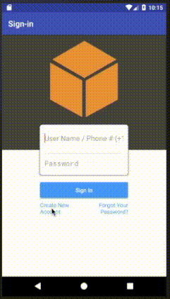

# Add Authentication to the Notes App

In the [previous section](./analytics.md)  of this tutorial, you created a mobile backend project using the AWS Amplify CLI, and then added analytics to the sample note-taking app. This section assumes you have completed these steps. If you jumped ahead to this step, [go back to the beginning](./index.md) and start from there. In this tutorial, you configure a sign-up and sign-in flow in our mobile backend. Then, you add a new authentication activity to the note-taking app.

You should be able to complete this section of the tutorial in 20-30 minutes.

## Set Up Your Backend

Before you work on the client-side code, you need to add user sign-in to the backend project.  These steps assume you have already completed the [analytics](./analytics.md) portion of this tutorial.

1. Open the project in Android Studio.
2. Choose **View** > **Tool Windows** > **Terminal**. This opens a terminal prompt in Android Studio at the bottom of the window.
3. In the terminal window, enter the following commands:

   ```
   $ amplify update auth
   ```

4. When prompted, use the default configuration.  When asked to overwrite the default authentication and security configuration, answer **Yes**.
5. Deploy your new resources with the following command:

   ```
   $ amplify push
   ```

The `amplify auth add` command creates an Amazon Cognito user pool configured for username and password authentication with phone verification of the sign-up and forgot password flows.  You can adjust this to include multi-factor authentication, TOTP, phone number sign-up, and more.

## Add the Authentication UI Library

1. Open the `app/build.gradle` file and add the following lines to the `dependencies` section:

    ```gradle
    dependencies {
        // Other dependencies will be here already

        // AWS Mobile SDK for Android
        def aws_version = '2.6.27'
        implementation "com.amazonaws:aws-android-sdk-core:$aws_version"
        implementation "com.amazonaws:aws-android-sdk-auth-core:$aws_version@aar"
        implementation "com.amazonaws:aws-android-sdk-auth-ui:$aws_version@aar"
        implementation "com.amazonaws:aws-android-sdk-auth-userpools:$aws_version@aar"
        implementation "com.amazonaws:aws-android-sdk-cognitoidentityprovider:$aws_version"
        implementation "com.amazonaws:aws-android-sdk-pinpoint:$aws_version"
    }
    ```

2. On the upper right, choose **Sync Now** to incorporate the dependencies you just declared.
3. Open the `Injection.java` file and add the following method declaration:

    ```java
    public static synchronized AWSService getAWSService() {
        return awsService;
    }
    ```

## Register the Email and Password Sign-in Provider

The sign-in UI is provided by `IdentityManager`. Each method of establishing identity (email and password, Facebook and Google) requires a plug-in provider that handles the appropriate sign-in flow.

1. Open your project in Android Studio.
2. Open the `service/aws/AWSService.java` class.
3. Add the following to the import declarations:

    ```java
    import com.amazonaws.mobile.auth.userpools.CognitoUserPoolsSignInProvider;
    ```

4. Adjust the constructor to add the `CognitoUserPoolsSignInProvider`.

    ```java
    public AWSService(Context context) {
        awsConfiguration = new AWSConfiguration(context);
        identityManager = new IdentityManager(context, awsConfiguration);
        identityManager.addSignInProvider(CognitoUserPoolsSignInProvider.class);
        IdentityManager.setDefaultIdentityManager(identityManager);
    }
    ```

## Add a AuthenticatorActivity to the Project

You can call the IdentityProvider at any point in your application. In this tutorial, you add a new screen to the project that is displayed before the list. The user will be prompted to sign-up or sign-in prior to seeing the list of notes. This ensures that all connections to the backend are authenticated.

**To add a AuthenticatorActivity to the project in Android Studio**

1. Right-click the `ui` package.
2. Choose **New** > **Activity** > **Empty Activity**.
3. For **Activity Name**, enter `AuthenticatorActivity`.
4. Choose **Finish**.

Add the following imports to the top of the `AuthenticatorActivity.java`:

```java
import android.app.Activity;
import android.content.Intent;
import android.support.v7.app.AppCompatActivity;
import android.os.Bundle;
import android.widget.Toast;

import com.amazonaws.mobile.auth.core.DefaultSignInResultHandler;
import com.amazonaws.mobile.auth.core.IdentityManager;
import com.amazonaws.mobile.auth.core.IdentityProvider;
import com.amazonaws.mobile.auth.ui.AuthUIConfiguration;
import com.amazonaws.mobile.auth.ui.SignInActivity;
import com.amazonaws.mobile.samples.mynotes.Injection;
import com.amazonaws.mobile.samples.mynotes.R;
```

Edit the `onCreate()` method of `AuthenticatorActivity.java` as follows:

```java
@Override
protected void onCreate(Bundle savedInstanceState) {
    super.onCreate(savedInstanceState);
    setContentView(R.layout.activity_authenticator);

    final IdentityManager identityManager = Injection.getAWSService().getIdentityManager();
    // Set up the callbacks to handle the authentication response
    identityManager.login(this, new DefaultSignInResultHandler() {
        @Override
        public void onSuccess(Activity activity, IdentityProvider identityProvider) {
            Toast.makeText(AuthenticatorActivity.this,
                    String.format("Logged in as %s", identityManager.getCachedUserID()),
                    Toast.LENGTH_LONG).show();
            // Go to the main activity
            final Intent intent = new Intent(activity, NoteListActivity.class)
                    .setFlags(Intent.FLAG_ACTIVITY_CLEAR_TOP);
            activity.startActivity(intent);
            activity.finish();
        }

        @Override
        public boolean onCancel(Activity activity) {
            return false;
        }
    });

    // Start the authentication UI
    AuthUIConfiguration config = new AuthUIConfiguration.Builder()
            .userPools(true)
            .build();
    SignInActivity.startSignInActivity(this, config);
    AuthenticatorActivity.this.finish();
}
```

> The AWS SDK for Android contains an in-built activity for handling the authentication UI.  This Activity sets up the authentication UI to work for just email and password, then sets up an activity listener to handle the response.  In this case, we transition to the `NoteListActivity` when a successful sign-in occurs, and stay on this activity when it fails. Finally, we transition to the Sign-In activity from the AWS SDK for Android library.

## Update the AndroidManifest.xml

The `AuthenticatorActivity` will be added to the `AndroidManifest.xml` automatically, but it will not be set as the default (starting) activity. To make the `AuthenticatorActivity` primary, edit the `AndroidManifest.xml`:

```xml
<activity
    android:name=".ui.AuthenticatorActivity"
    android:label="Sign In"
    android:theme="@style/AppTheme.NoActionBar">
    <intent-filter>
        <action android:name="android.intent.action.MAIN" />
        <category android:name="android.intent.category.LAUNCHER" />
    </intent-filter>
</activity>
<activity
    android:name=".ui.NoteListActivity"
    android:label="@string/app_name"
    android:theme="@style/AppTheme.NoActionBar">
    <!-- Remove the intent-filter from here -->
</activity>
```

The `.AuthenticatorActivity` section is added at the end. Ensure it is not duplicated. If the section is duplicated, build errors occur.

## Run the Project and Validate Results

In the emulator, run the project using **Run** > **Run 'app'**. You should see a sign-in screen. Choose **Create new account** to create a new account. After the information is submitted, you should receive a confirmation code via email. Enter the confirmation code to complete registration, and then sign-in with your new account.

> **Tip**
>
> If you don't want to use your own email account as a test account, create an [Amazon WorkMail](https://aws.amazon.com/workmail/) service within AWS for test accounts. You can get started for free with a 30-day trial for up to 25 accounts.



## Next Steps

* Continue by integrating a [Serverless Backend](./data.md).
* Learn more about [Amazon Cognito](https://aws.amazon.com/cognito/).
