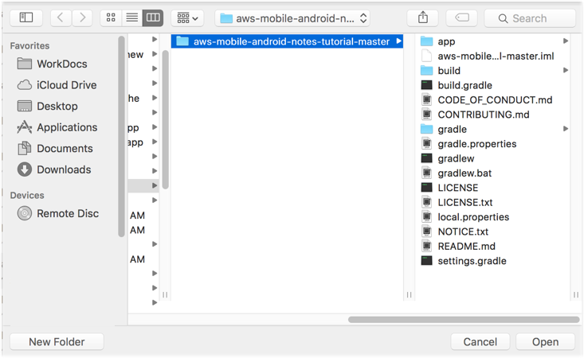

# Tutorial: Create a Simple Android Note-Taking App

In this tutorial, you start with a working app, driven by locally stored data, and then add cloud-enabled features as follows:

* [Add analytics to your app](./analytics.md) so you can view demographic information about your users.
* [Add a simple sign-in/sign-up flow](./auth.md) for authentication.
- [Access data stores in the AWS cloud](./data.md), so that a user's notes are available to them on any device with the app installed.

You should be able to complete the setup section of this tutorial within 10-15 minutes after you have installed all required software. After you complete the following instructions, you can run the project on your local system.

## Getting Started

Before you begin, do the following:

1. Complete the [Getting Started](https://aws-amplify.github.io/media/get_started) instructions to install the Amplify CLI.
2. Download and install [Android Studio](https://developer.android.com/studio/index.html) version 3.0.1 or later.
3. Download and install [Android SDK](https://developer.android.com/studio/intro/update.html#sdk-manager) version 8.0 (Oreo), API level 26.
4. Install an [Android Emulator](https://developer.android.com/studio/run/managing-avds.html). The app works with both phone and tablet emulators (for example, the Nexus 5X or Pixel C).

## Download the Source Code

Download the source code as a [ZIP file](https://github.com/aws-samples/aws-mobile-android-notes-tutorial/archive/master.zip).  After the download is complete, unpack the downloaded ZIP file.

## Compile the Source Code

To compile the source code, do the following:

1. Start Android Studio.
2. If you have a project open already, choose **File** > **Close Project**.
3. Choose **Open an existing Android Studio project**.
4. Find and choose the _aws-mobile-android-notes-tutorial-master_ project in your file system, and then choose **OK**.

   

5. On the menu bar, choose **File** > **Sync Project with Gradle Files**.
6. On the menu bar, choose **Build** > **Make Project**.

The compilation step should finish with no errors. Errors are displayed in the **Messages** window, which is available on the status bar at the bottom of the project.

## Run the Project in an Emulator

If you haven't already done so, create a new emulator as follows:

1. Choose **Tools** > **Android** > **AVD Manager**.
2. Choose **Create Virtual Device...**.
3. Choose **Phone**  > **Nexus 5X**, and then choose **Next**.
4. Choose the **x86 Images** tab, and then choose **Android 8.0 (Google APIs)**.
    * If you didn't previously downloaded the image, you can download it from this screen.
5. Choose **Next**.
6. Choose **Finish**.
7. Close the AVD Manager.

Run the project in an emulator as follows:

1. Choose **Run** > **Run 'app'**.
2. Choose the **Nexus 5X API 26** virtual device.
3. Choose **OK**.

If it isn't already running, the Android emulator starts and then the application runs. You should be able to interact with the application as you would any other mobile app. Try pressing on the plus sign + at the of the app to create a note, or choose a note to show in the editor screen. A unique ID for each note is displayed in the list view underneath the note's title.

## Troubleshooting

The most common problems at this stage involve issues with the installation of Java, Android Studio, the Android SDK, or the Android Emulator. Google provides detailed instructions about [Android Studio](https://developer.android.com/studio/index.html>) and dependent features.

## Next Step

Next, [integrate application analytics](./analytics.md) into your project.
